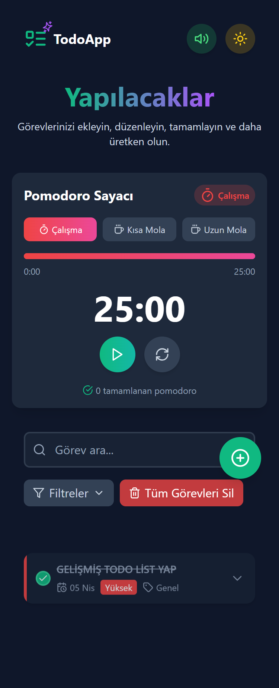

Modern Todo App Sitesi
Modern ve kullanıcı dostu bir görev yönetim uygulaması.
Canlı Hali: https://modern-todoapps.netlify.app/
## Uygulama Görünümü

### Masaüstü Görünümü


### Mobil Görünümü


## Özellikler

- 🌓 Koyu ve Açık mod desteği
- ⏱️ Pomodoro zamanlayıcı
- 🔊 Ses bildirimleri (açılıp kapatılabilir)
- 🗂️ Görevleri filtreleme ve sıralama
- 📱 Responsive tasarım
- 🚀 Drag & Drop ile görev sıralaması
- 🏷️ Öncelik etiketleri
- 📋 Görevleri arşivleme
- 📅 Tarih bazlı görev yönetimi

## Teknolojiler

- React
- TypeScript
- Vite
- TailwindCSS
- Context API
- Local Storage

## Kurulum

```bash
# Projeyi klonlayın
git clone https://github.com/pave5866/Modern-todo-app.git

# Proje klasörüne girin
cd modern-todo-app

# Bağımlılıkları yükleyin
npm install

# Geliştirme sunucusunu başlatın
npm run dev
```

## Kullanım

1. Yeni görev eklemek için sağ alt köşedeki "+" butonuna tıklayın
2. Görevlerinizi tamamlamak için yanlarındaki kutucuğu işaretleyin
3. Pomodoro zamanlayıcı ile çalışma verimliliğinizi artırın
4. Görevlerinizi filtreleyerek daha kolay yönetin
5. Sürükle & bırak ile görevlerinizi yeniden sıralayın

## Lisans

MIT 
